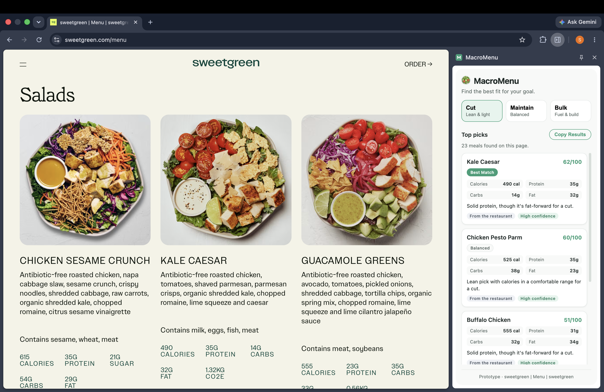

# MacroMenu

A privacy-first Chrome extension that reads restaurant menus in the browser and scores entrees from 0 to 100 against your fitness goal.

**Status: v0.1.0 prototype.** It runs entirely on your machine, makes no network requests of its own, and has no accounts. It is an early prototype, not a finished product. See [Current limitations and roadmap](#current-limitations-and-roadmap) for an honest account of what is rough.

<!--
TODO (Sofie): add a screenshot or GIF here.
Suggested capture: open the side panel on a Sweetgreen menu, pick the "Cut" goal,
and grab the ranked cards showing scores, macros, and explanations.
Save it as docs/screenshot.png (create the docs/ folder) and the line below will render it.
-->


## How it works

When you open the side panel on a restaurant page, MacroMenu reads the rendered DOM of that tab and pulls out the entrees: dish name, description, and nutrition facts when the page publishes them. Each entree goes through a deterministic, rule-based scoring engine that produces a 0 to 100 score and a plain-English explanation of why it ranked where it did. When a restaurant publishes its own macros, MacroMenu uses them as-is and labels the meal "From the restaurant." When it does not, MacroMenu estimates from a local nutrition data source (`data/nutritionTable.js`), lists every assumption it made, and labels the meal "Estimated from common assumptions." Every result carries a confidence level (high, medium, or low), and estimates that fall below a confidence floor are held back rather than shown as fact.

## Design decisions

**Local-first and privacy-first.** MacroMenu runs entirely in the browser. It makes no network requests of its own, stores nothing off-device, and has no accounts. It reads a tab's URL only to decide whether to show the panel, and nothing is logged or sent anywhere.

**A deterministic rules engine for v0.1.** The scoring and estimation are pure rule-based logic, not a model. That was a deliberate choice for this version, for three reasons:

- **Explainability.** Every score traces back to specific macros, and every estimate lists the assumptions behind it. A reviewer, or a user, can check the math.
- **Auditability.** The same input always produces the same output, which is what makes the test suite meaningful and regressions catchable.
- **Cost.** No API keys and no per-request billing, so the tool stays free to run.

AI-assisted parsing and macro estimation are planned for later versions to improve accuracy where the rules fall short. The goal of starting deterministic was to get the scoring model, the explanations, and the interface right against data fully under control, then layer AI in behind the same interface. This is about explainability and cost, not a stance against LLMs.

<details>
<summary><strong>Under the hood</strong> (engineering notes, for the curious)</summary>

Many of the rules in here exist because a real menu or a real browser quirk broke an earlier version.

- **The injected page reader must be fully self-contained.** `chrome.scripting` serializes the function with `toString()` and rebuilds it inside the page, so any outside reference throws there and silently returns an empty snapshot. A test re-runs it through `new Function` to prove it still stands alone. (`content/pageSnapshot.js`, `test/pageSnapshot.test.js`)
- **A rendered page needs its own extraction path, not a patch to the text parser.** `text-transform: uppercase` turns a dish name into what looks like a section heading, block elements insert blank lines the line parser reads as "item ended," and a calorie count and a price are both bare three-digit numbers. (`services/ingestion/domMenuExtractor.js`)
- **Believing a restaurant's own macros has a high bar:** all four macros or none, grams stated explicitly, and the four numbers must roughly agree with the stated calories. (`services/ingestion/publishedMacros.js`)
- **PDF parsing hit real-file gotchas:** the token `endstream` ends with the token `stream`, and incrementally-updated PDFs keep both revisions, so a naive scan extracts the menu twice. (`services/ingestion/pdfExtractor.js`)
- **Scoring is transparent by construction.** Base weights are protein-to-calorie efficiency 50%, goal fit 25%, total protein 12.5%, macro balance 12.5%, with penalties and hard caps applied after. A test asserts that an explanation can never contradict the meal's own macros. (`services/scoringService.js`)

Rough repository map:

```
manifest.json                     Manifest V3 config
background.js                     Service worker, manages the side panel
sidepanel.html / .css / .js       Side panel UI and controller
config.js                         App config and data-source feature flags
content/pageSnapshot.js           Injected into the tab, walks the rendered DOM
data/                             Local nutrition table, portions, ingredient dictionary
services/scoringService.js        Ranking engine (goals as data)
services/confidenceScoring.js     Parse and macro confidence rules
services/menuExtractionService.js Public entry: extractMenu(), toRankableMeals()
services/ingestion/               HTML / PDF / text / DOM extraction pipeline
services/nutrition/               Dish typing, ingredient detection, macro estimation
scripts/test-menu-extraction.js   CLI: run extraction against a file or URL
test/                             Regression suite (node --test, no dependencies)
```

</details>

## Install and run locally

Requires Chrome 114 or newer (for the Side Panel API). Running the tests needs Node 18 or newer.

**Load the extension:**

1. Clone this repository.
2. Open `chrome://extensions`.
3. Turn on **Developer mode** (top-right toggle).
4. Click **Load unpacked** and select the project folder (the one containing `manifest.json`).
5. Click the MacroMenu icon in the toolbar. The panel opens on the right. Open it on a restaurant menu page.

**Run the test suite:**

```bash
npm test
```

That runs the full regression suite with Node's built-in test runner. There are no dependencies to install.

## Validation

MacroMenu is validated two ways.

**Automated regression suite.** `npm test` runs a dependency-free suite (Node's built-in runner) covering the parsing and scoring edge cases that real menus exposed. It includes DOM blocks captured verbatim from live sites, including Sweetgreen and Panera, plus fixtures drawn from Chipotle, True Food Kitchen, Fratellino's, Celebration Restaurant, and Nice Matin.

**Manual testing against live menus.** During development the extension was run by hand against real restaurant sites, including Sweetgreen and Just Salad, to confirm it pulls the right dish title, description, and published nutrition facts. Coverage so far is a limited set of sites, not an exhaustive sweep.

**Macro accuracy work is ongoing.** Restaurant nutrition PDFs (Mendocino Farms among them) are being cross-referenced against the estimator to tighten the numbers, and more are being added over time.

## Current limitations and roadmap

This is a v0.1.0 prototype. On supported sites it does real work end-to-end: it reads the page, ranks the entrees, and explains the scores. Several parts are still rough or incomplete, and this section is the honest account of them.

**What is weak or missing today:**

- **Estimation accuracy is the weakest part.** When a page does not publish its own macros, MacroMenu estimates from local assumptions. Those estimates are often close but not exact, and they tend to underestimate calories and protein. This is the piece I am least satisfied with. Treat estimated meals as guidance, not a food log.
- **Site coverage is uneven.** The DOM reader does well on the sites I have tested (Sweetgreen is a strong case, and published nutrition facts come through reliably when a page provides them), but it does not read every site's markup correctly, and I have not tested it broadly. I am not yet fully confident outside the sites I have tried.
- **PDF menus are not readable in the browser yet.** The side panel currently reads only the rendered DOM of the active tab. The extraction engine does have a PDF path, exercised by the tests and the `test:menu` CLI, but it is not wired into the panel, so pointing the extension at a PDF menu in the browser does not work.
- **No OCR.** A menu that is a single scanned image is flagged as needing OCR, not guessed at.

**If I started over:** I would have spent more time up front on using an LLM API for macro estimation rather than hand-building a nutrition database. That is the direction I want to take accuracy.

**Roadmap for v0.2 and beyond:**

- Move macro estimation to an AI-assisted approach to improve accuracy where the local table falls short.
- Wire PDF menu reading into the extension.
- Support a wider range of restaurant websites.
- Keep cross-referencing restaurant nutrition PDFs into the estimator to tighten the numbers. This work is ongoing.

## Built with Claude

MacroMenu was designed, built, and tested end-to-end with Claude and Claude Code.

## Version

v0.1.0, an early prototype. It is not a finished or production product, and the interfaces, scoring, and data are still changing.

---

*MacroMenu is a wellness tool, not medical or dietary advice.*
